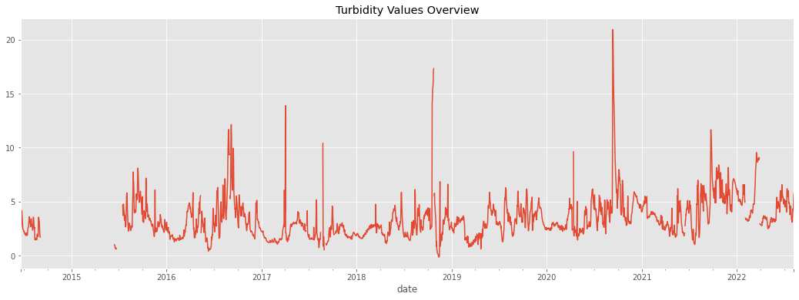

# HFF_Water
### Harrison Carter
### NYC-DS-051622
## Business Understanding
Henry's Fork Foundation aims to preserve and restore the natural water quality of the Henry's Fork of the Snake River and its watershed. While their responsibilities are many, one of their chief aims is to use modern scientific techniques to keep tabs on the river and ensure local industrial and commercial practices are not interfering with its overall health and aesthetics. In turn, the river provides habitat for local flora and fauna, not to mention a large portion of the tourism revenue for the surrounding towns in the form of sport fishing.

To ensure optimal fishing experience the water conditions must be within acceptable ranges. Turbidity is the measure of clarity of a liquid, and in this case is very important to this experience. According to my correspondence with their Senior Scientist, Rob Van Kirk, "Turbidity is the single biggest factor affecting fishing experience. Anglers can't see things like dissolved oxygen or nutrient concentrations, but they can see how clear or dirty the water is. By far the single biggest complaint I get about fishing conditions is how turbid the water is."

I have been tasked with assessing and modeling data from multiple sources to determine major factors and predictors that contribute to turbidity in the river. Using this analysis and its framework, future scientists may be able to forecast water clarity and even mitigate contributing factors.
## Data Understanding
The first dataset comes from the publically available sonde data at [HFF.org](https://henrysforkdata.shinyapps.io/scientific_website/). This data is updated every 15 minutes using an in-water monitoring device called a sonde. These devices measure water temperature, turbidity, dissolved oxygen, conductivity, phytoplankton, and cyanobacteria content. While the other factors can contribute to the turbidity of a system on their own, they do not provide a complete picture.

We chose the sonde at this location because it is the head of one of the best regarded fishing areas, and its location just a few hundred yards downstream from Island Park Dam makes turbidity there less predictable and of higher concern. Determining the contributing factors to water clarity here could prove valuable in understanding how activity and management at Island Park reservoir impact the downstream water conditions.

The second dataset comes from the [US Bureau of Reclamation](https://www.usbr.gov/projects/index.php?id=151) and contains historical data regarding the water in island park reservoir, including in/outflow, elevation, and overall change in volume. While this data does not directly address the clarity of the water, the rate of flow in and out of the reservoir may kick up sediment and with the amount of exposed shoreline may affect the rate at which the shoreline erodes into the reservoir. This data dates back to 1929 which may be interesting to explore further once we have established the relevant tools for the job.

The third dataset comes from the [USDA Snotel Natural Resources Conservation Service
National Water and Climate Center](https://wcc.sc.egov.usda.gov/reportGenerator/view/customChartReport/daily/start_of_period/546:ID:SNTL%7Cid=%22%22%7Cname/CurrentWY,CurrentWYEnd/WTEQ::median_1981,WTEQ::median_1991,PREC::average_1981,PREC::median_1991?fitToScreen=false&useLogScale=false) which provides snow and climate monitoring at specific sites across the entire USA. The dataset we have is localized to our region, which we narrow further to sites that affect the watershed into the reservoir's tributaries. This has been collected since 1988 for this locale, which we again narrow into a timeframe we can use. The data includes the temperature at these sites, the daily and average precipitation, and the amount of water currently at the site in the form of snow.
## Data Preparation
First we import relevant libraries and format the data to be readable as a timeseries. Then, in order to get the data into a time scale that is relevant to the other datasets we downsample to daily frequency and split the data into training and testing sets. The data is in a timeseries, which precludes traditional random train/test splitting, and must be done using values that are in sequence. In this case, we take the most recent year with relatively complete data as the test set, and the rest of the complete years as the training data.

When we inspect the turbidity values here, we see there is a rather large gap early on in the time series, and a few smaller ones later on. These may bee too large for simple interpolation, especially with the high variance in data values over a short period of time. For this reason we will later drop these sections. Other NaN values will be interpolated over using the splining method to attempt to anticipate the patterns before modeling.
