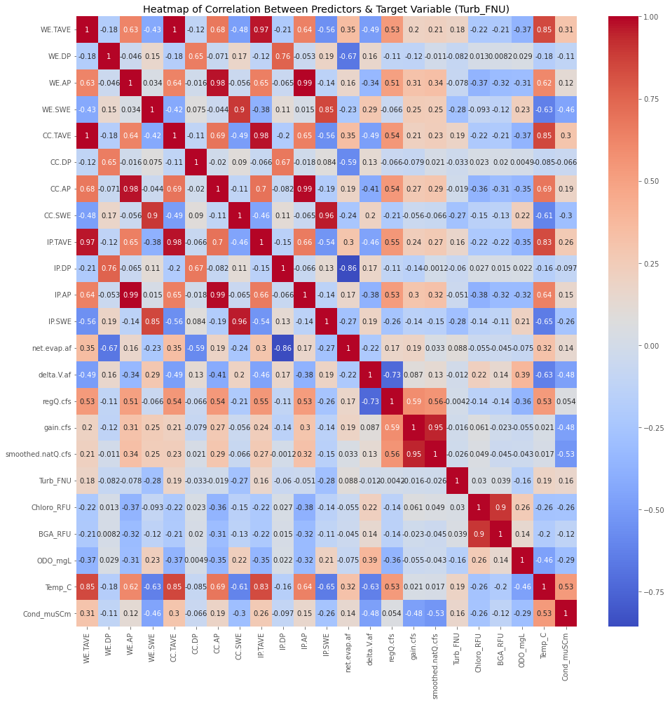
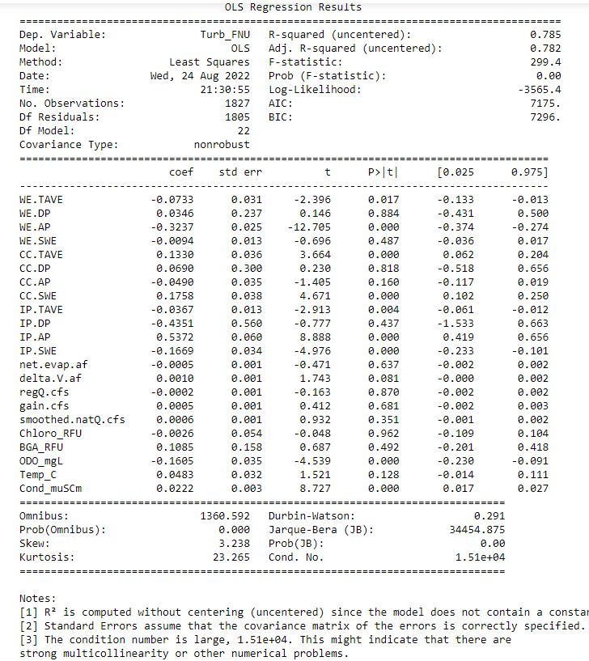
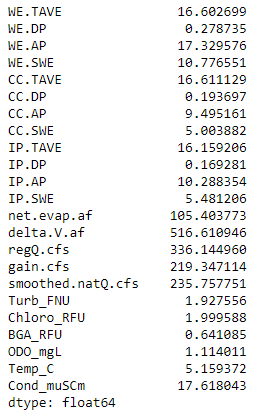
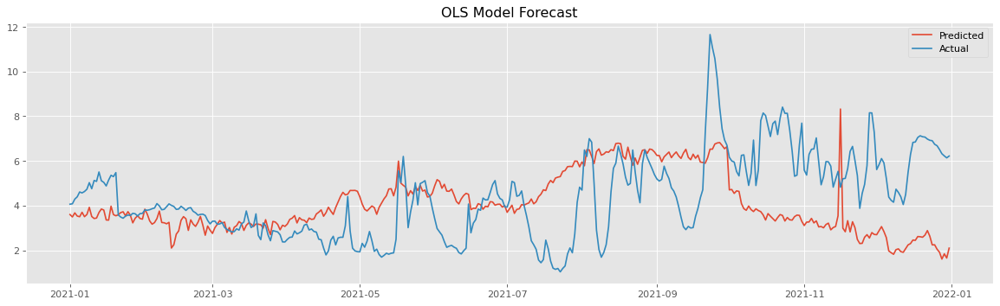
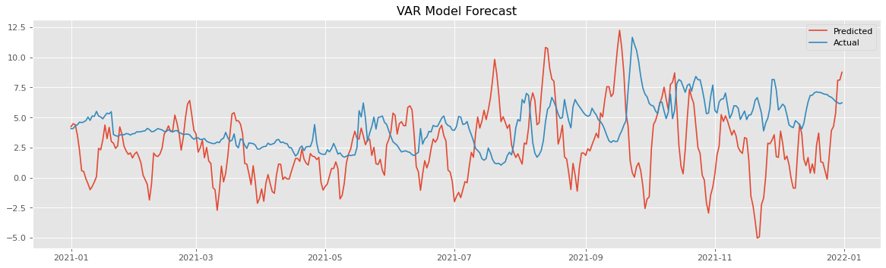
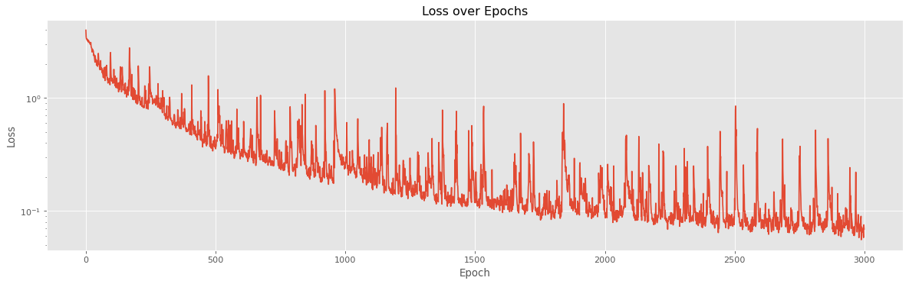
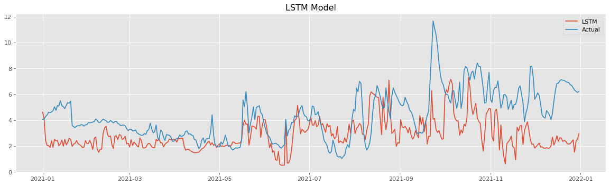

# Henry's Fork Turbidity at Island Park Dam
### Harrison Carter
### NYC-DS-051622
## Business Understanding
Henry's Fork Foundation aims to preserve and restore the natural water quality of the Henry's Fork of the Snake River and its watershed. While their responsibilities are many, one of their chief aims is to use modern scientific techniques to keep tabs on the river and ensure local industrial and commercial practices are not interfering with its overall health and aesthetics. In turn, the river provides habitat for local flora and fauna, not to mention a large portion of the tourism revenue for the surrounding towns in the form of sport fishing.

To ensure optimal fishing experience the water conditions must be within acceptable ranges. Turbidity is the measure of clarity of a liquid, and in this case is very important to this experience. According to my correspondence with their Senior Scientist, Rob Van Kirk, "Turbidity is the single biggest factor affecting fishing experience. Anglers can't see things like dissolved oxygen or nutrient concentrations, but they can see how clear or dirty the water is. By far the single biggest complaint I get about fishing conditions is how turbid the water is."

I have been tasked with assessing and modeling data from multiple sources to determine major factors and predictors that contribute to turbidity in the river. Using this analysis and its framework, future scientists may be able to forecast water clarity and even mitigate contributing factors.
## Data Understanding
The first dataset comes from the publically available sonde data at [HFF.org](https://henrysforkdata.shinyapps.io/scientific_website/). This data is updated every 15 minutes using an in-water monitoring device called a sonde. These devices measure water temperature, turbidity, dissolved oxygen, conductivity, phytoplankton, and cyanobacteria content. While the other factors can contribute to the turbidity of a system on their own, they do not provide a complete picture.

We chose the sonde at this location because it is the head of one of the best regarded fishing areas, and its location just a few hundred yards downstream from Island Park Dam makes turbidity there less predictable and of higher concern. Determining the contributing factors to water clarity here could prove valuable in understanding how activity and management at Island Park reservoir impact the downstream water conditions.

The second dataset comes from the [US Bureau of Reclamation](https://www.usbr.gov/projects/index.php?id=151) and contains historical data regarding the water in island park reservoir, including in/outflow, elevation, and overall change in volume. While this data does not directly address the clarity of the water, the rate of flow in and out of the reservoir may kick up sediment and with the amount of exposed shoreline may affect the rate at which the shoreline erodes into the reservoir. This data dates back to 1929 which may be interesting to explore further once we have established the relevant tools for the job.

The third dataset comes from the [USDA Snotel Natural Resources Conservation Service
National Water and Climate Center](https://wcc.sc.egov.usda.gov/reportGenerator/view/customChartReport/daily/start_of_period/546:ID:SNTL%7Cid=%22%22%7Cname/CurrentWY,CurrentWYEnd/WTEQ::median_1981,WTEQ::median_1991,PREC::average_1981,PREC::median_1991?fitToScreen=false&useLogScale=false) which provides snow and climate monitoring at specific sites across the entire USA. The dataset we have is localized to our region, which we narrow further to sites that affect the watershed into the reservoir's tributaries. This has been collected since 1988 for this locale, which we again narrow into a timeframe we can use. The data includes the temperature at these sites, the daily and average precipitation, and the amount of water currently at the site in the form of snow.
## Data Preparation
First we import relevant libraries and format the data to be readable as a timeseries. Then, in order to get the data into a time scale that is relevant to the other datasets we downsample to daily frequency and split the data into training and testing sets. The data is in a timeseries, which precludes traditional random train/test splitting, and must be done using values that are in sequence. In this case, we take the most recent year with relatively complete data as the test set, and the rest of the complete years as the training data.

When we inspect the turbidity values here, we see there is a rather large gap early on in the time series, and a few smaller ones later on. These may bee too large for simple interpolation, especially with the high variance in data values over a short period of time. For this reason we will later drop these sections. Other NaN values will be interpolated over using the splining method to attempt to anticipate the patterns before modeling.

Here, we have a correlation matrix which shows the raw correlation between values in the dataset. This displays potential sources of collinearity where the correlation is high. It also shows that none of the variables are directly correlated very highly with turbidity, meaning more advanced regression is required to determine the relationships.
## OLS Model
First, we determine feature importance for a simple model to give an idea of the weights of the explanatory variables on turbidity. An OLS model allows us to use multivariate regression to capture the variance in the data.

This adjusted R2 value shows that the variance in the turbidity is about 79% captured by the explanatory variables according to this model. This does not necessarily mean our model can't get any better than this, but it may represent a loose ballpark for the upper bounds of how accurately we can predict the turbidity using basic methods. Additionally, multicollinearity is high here, which is to be expected. This can be mitigated by eliminating columns or using models that eliminate multicollinearity issues going forward.

The Durbin-Watson score here is low, implying the variance of the data is not constant throughout. This makes sense in this case, as even though the data is from the same time frame, it comes from three completely different sources. This is something to keep in mind and can be eliminated using a transformation. 

The coefficients here represent the amount of change in turbidity for a one unit change in the explanatory variable in question. Higher values can denote a larger influence in this simple model, but it is important to take into mind the scale of the variable and compare, which is why the standard deviation is included for context. If the coefficient is large but the scale of the variable is also large, that might not mean as significant an influence.

The p values here also should be taken in with a grain of salt, as a p value lower than 0.05 should mean we can reject the null hypothesis that the variable has no influence on the turbidity, and the converse is also true, that if the p value is higher than 0.05 we can reject the alternative hypothesis that the variable does have a significant influence. Using our background knowledge however, we know that high amounts of chlorophyll and BGA are linked to higher turbidity, which does not seem to be the case in this regression.

From this, we see that the factors that have a direct impact via low p values and high coefficients relative to their scale are all temperatures at the Snotel sites, which are collinear, as well as the amount of snow at the Island Park and Crab Creek sites. As snow melts at the Crab Creek site, the turbidity increases at Island Park, and then as the amount of snow increases at Island Park, the turbidity also increases, reflecting the effects of increased inflow into the reservoir from this inlet and possibly the effects of inclement weather respectively, as in the latter the average precipitation also has a low p value. The amount of dissolved oxygen also negatively correlates with the turbidity, showing that the conditions that increase turbidity also decrease the amount of biologically available oxygen. The conductivity positively correlates with the turbidity, which tracks, as the amount of dissolved salts and other inorganic compounds could hamper water clarity.

RMSE value averages the square of all the errors, and then takes the square root to get the number back into the scale of the data. The RMSE for the predictions vs actual here is surprisingly low at 0.53, meaning given the information, this model is actually quite good.

The drawback of this model is that the data you provide it will often already contain the turbidity value, given the sonde. It can, however, be used to estimate the turbidity in cases where we have an idea going in of what the values for the predictors might be, as in the prediction for 2021. This means that this model cannot forecast very well without being given information about the future.

## VAR Model
The VAR model is a multivariate timeseries model that allows us to quickly compare the past and present verisions of a dataset to examine their relationship. This model does well for recurring patterns by creating vectors out of the predictor variables relationships, and then continuing the patterns for all variables.

The above is the predicted values for turbidity using VAR. This result is if we were to predict the entire year without knowing any of the values for the predictor variables for the year. This shows that although the explanatory variables do contribute to the turbidity value, they themselves are not predictable due to major contributing factors not explained by the data.

The RMSE here is much worse, at 4.5, as the forecast has no information about the future values for which it is predicting, explanatory variables or otherwise. That said, the overall variance gets larger as the year goes on in both the predicted and actual values much like the years prior. The highs also seems to match the nearby peaks in the actual data as well.
## LSTM Neural Network
Long Short Term Memory(LSTM) networks are a style of Recurrent Neural Network(RNN). RNNs are machine learning models that use the previous values to help predict the future values, and are the neural networks generally best suited to dealing with time series values. This works in theory, but these models tend toward stasis as they try to forecast further into the future. This essentially means that while the most recent values still affect the model, as the old ones get further from the current prediction, they begin to lose importance.

LSTM networks alleviate this problem by selectively forgetting information that it deems unimportant, while retaining the information it deems important. It determines the importance of the previous input using a sigmoid function to and then uses the same function along with the current input to create a vector telling the model how much of the new information to include in the new memory state. This new memory state is then retained and considered in with the next input, and so on.

The predicted and actual values for turbidity in 2021 are displayed in the graph above. Many of the peaks and valleys match up even though their magnitude may not always match. The RMSE here is relatively low, roughly a third of that of the VAR model, and shows that for any given point in time, the model is on average only off by 1.3.

While the RMSE for this model is not as high as that of the OLS model, this model stands to improve the most without considering new variables, given that the machine learning element of this model automatically picks up the signal, and that the loss is steadily decreasing, even after 3000 epochs.
## Conclusions
All three models have their merits, and picking one requires knowledge of their underlying principles and the desired result. The fastest way to get a low variance prediction that is closest to the mean of forecasted values is the OLS regression. This model also has the added advantage of describing the relationship of the predictor variables to the turbidity, which is one of the major goals of this project. The most important factors are precipitation and snowmelt at White Elephant, which feeds rivers upstream in the Mack's Inn area, precipitation and snowmelt at the Island Park Dam, dissolved oxygen, which decreases as turbidity goes up, conductivity, with a positive correlation with turbidity, and temperature at both Island Park Dam and White Elephant. The disadvantage of this model is that it needs estimates for the future values of these explanatory variables in order to work.

The VAR model is possibly the best to use when you have no future data and this is its strongest point. The predictions it generates approximate the typical year of turbidity, with some flaws. The variance at the start of the year is a little too much, and the peaks do not line up exactly when they should happen, although this latter problem is likely caused by meteorological events not included in our data.

The LSTM model is the most adaptible, and can forecast with or without the explanatory variables provided. In this way it acts as sort of a blend of the previous two models, and with a relatively low RMSE it still predicts spikes in turbidity fairly wel, as opposed to the VAR model. Where the VAR is set up to forecast given no extra information out of the box, the LSTM could in the future use the predictions of the VAR model to provide more accurate results. As far as monitoring the turbidity, the best way to do that is the LSTM model with forecsats for the other variables provided.
